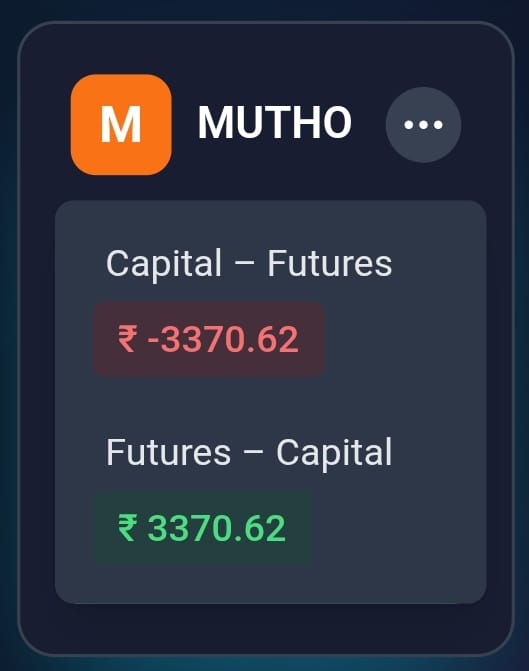
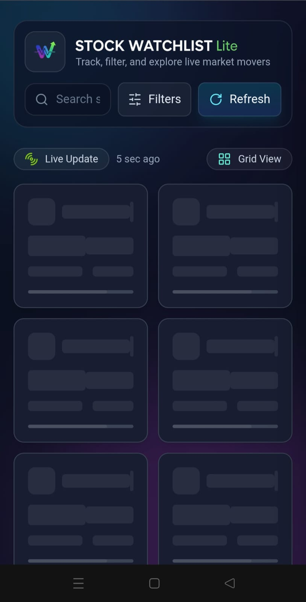

# Stock Watch List Lite

Welcome to the **Stock Watch List Lite** project! This is a simple tool designed to help you track and monitor stock market data.

---
<br><br>

# Tech Stack

- **Frontend:** React.js (Vite)

- **Styling:** TailwindCSS

- **Charting:** Chart.js, react-chartjs-2, chartjs-adapter-date-fns

- **Icons:** Lucide React

- **Notifications:** react-hot-toast

- **State Management:** React Hooks (useState, useEffect, useRef)

- **Testing:** Jest

- **Deployment:** Vercel

<br><br>


# How to Run the Project

Follow these steps to set up and run the project on your system:

### 1. Install Dependencies

Navigate to your project directory and run:

```
npm install
```


### 2. Start the Development Server

Once dependencies are installed, start the app in development mode:

```
npm run dev
```

Open your browser and visit: http://localhost:5173


### 3. Run Tests

To run the project tests using Jest:

```
npm run test
```


<br><br>

# Clarifying Questions & Assumptions

 ### 1. Should the data be completely static or should we simulate `random updates` every few seconds?

 ### 2. Do we need to support multiple themes like `dark mode` and `light mode`?

 ### 3. Should the `chart` in the details drawer be interactive or just a `static view`?

 ### 4. Is it okay to use `libraries` like `Chart.js` for the chart, or should we build it from scratch?

 ### 5. Do you want `animations` when `toggling` between `View A` and `View B`?

<br><br>

# Implemented Features

- ### Display `6 stock cards` per row on desktop and wrap on smaller screens
- ### Show stock details like `Trading Symbol`, `Capital Market Price`, `Futures Price`, `Percentage Change`, and `last updated time`
- ### `Toggle` between two views for `price comparison`
- ### `Search bar` to filter by Trading Symbol
- ### `Sort` options by `percentage change`, `capital market price`, and `futures price`
- ### Open `details drawer` with a `dummy chart`using `random` data and stock information
- ### Show `error state` when data is `missing`
- ### `Refresh` button to `reload data`
- ### Show `loading skeletons` when data is being `fetched`
- ### `Retry` option if an `error occurs`
- ### `Unit tests` for main functionalities

<br><br>

# Tradeoffs and Next Steps

- ### The chart uses `random data` instead of real market data

- ### `Error simulation` is random and may not cover all possible edge cases

- ### The UI could be improved with more `animations` and `transitions`

- ### Adding real `API` integration would make the app more `useful`

<br><br>
# Originality & Problem-solving

In this project, I `carefully thought` about how users would interact with a `stock watchlist app`. I built the app with my `own structure` and `logic`.

- ## Some problem-solving steps I took:

    - ### I used dummy data and simulated data fetching using `setTimeout` to create a real-like experience without using an `API`.
    - ### I implemented `error handling`, so if the data is missing or a fetch fails, the app shows a `user-friendly message` instead of crashing.
    - ### I structured the code with reusable components like `StockCard`, `ErrorState`, and `FilterDrawer`, `More` so it is clean and easy to manage.
    - ### I wrote `unit tests` using `Jest` and React `Testing Library` to check that the main functionalities work as expected.
    - ### I used `styling`, and `transitions` to make the interface smooth and intuitive.

    ## These steps helped me solve challenges like handling missing data, improving responsiveness, and making the app user-friendly.

<br><br>


# 🌐 Deployment

### This project is deployed on Vercel. You can view the live project here:  
## [Stock Watch List Lite](https://stock-watch-list.vercel.app/)🌐

<br><br>

# Notes

- ### Beginner-friendly and perfect for understanding `React`, `Tailwind CSS`, and basic `stock tracking` applications.
- ### Designed as a `Lite version`, expandable to a full-featured `stock watch app`.


<br><br><br>
# 📸 Screenshots

# Desktop and Laptop View

 - ### `Home Page View `                               
      
 - ### `Error Fetch View`                  
     
 

 - ### `Grid View` 
                                    
 - ### `List View ` 
                            
  
 

 - ### `Search View `
                                  
 - ### `Search Not Found View`  
                 
  
 

 - ### `Details Drawer View` 
                          
 - ### `Missing Data Drawer View` 
              
  
 

 - ### `Filter Drawer View ` 
                          
 - ### `Card Toggle View ` 
         
 - ### `Card Skeleton View`
                
  
 <br><br>

# 📱 Mobile Responsive View

| ### `Home Page View` | ### `Error Fetch View` | ### `Grid View` |
|---|---|---|
|  |  |  |

| ### `List View` | ### `Search View` | ### `Search Not Found View` |
|---|---|---|
|  |  |  |

| ### `Details Drawer View` | ### `Missing Data Drawer View` | ### `Filter Drawer View` |
|---|---|---|
|  |  |  |

| ### `Card Toggle View` | ### `Card Skeleton View` |   |
|---|---|---|
|  |  |   |

