 

### Welcome to the **Stock Watch List Lite** project! This is a simple tool designed to help you track and monitor stock market data.

**Developed by: [Suvrodip Chakroborty](https://suvrodip-chakroborty.vercel.app/)🌐**

---

<br>

# Tech Stack

- **Frontend:** `React.js (Vite)`

- **Styling:** `TailwindCSS`

- **Charting:** `Chart.js`, `react-chartjs-2`, `chartjs-adapter-date-fns`

- **Icons:** `Lucide React`

- **Notifications:** `react-hot-toast`

- **State Management:** `React Hooks` (`useState`, `useEffect`, `useRef`)

- **Testing:** `Jest`

- **Deployment:** `Vercel`

<br>

# How to Run the Project

Follow these steps to set up and run the project on your system:

### 1. Install Dependencies

Navigate to your project directory and run:

```
npm install
```

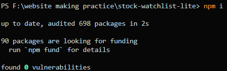

### 2. Start the Development Server

Once dependencies are installed, start the app in development mode:

```
npm run dev
```

Open your browser and visit: http://localhost:5173

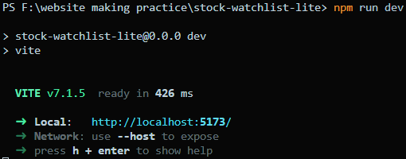

### 3. Run Tests

To run the project tests using Jest:

```
npm run test
```

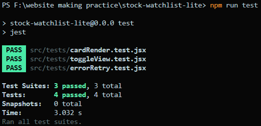

# Clarifying Questions & Assumptions

**1. Should the data be completely static or should we simulate `random updates` every few seconds?**

**2. Do we need to support multiple themes like `dark mode` and `light mode`?**

**3. Should the `chart` in the details drawer be interactive or just a `static view`?**

**4. Is it okay to use `libraries` like `Chart.js` for the chart, or should we build it from scratch?**

**5. Do you want `animations` when `toggling` between `View A` and `View B`?**

<br>

# Implemented Features

- **Display `6 stock cards` per row on desktop and wrap on smaller screens**
- **Show stock details like `Trading Symbol`, `Capital Market Price`, `Futures Price`, `Percentage Change`, and `last updated time`**
- **`Toggle` between two views for `price comparison`**
- **`Search bar` to filter by Trading Symbol**
- **`Sort` options by `percentage change`, `capital market price`, and `futures price`**
- **Open `details drawer` with a `dummy chart`using `random` data and stock information**
- **Show `error state` when data is `missing`**
- **`Refresh` button to `reload data`**
- **Show `loading skeletons` when data is being `fetched`**
- **`Retry` option if an `error occurs`**
- **`Unit tests` for main functionalities**

<br>

# Tradeoffs and Next Steps

- **The chart uses `random data` instead of real market data**

- **`Error simulation` is random and may not cover all possible edge cases**

- **The UI could be improved with more `animations` and `transitions`**

- **Adding real `API` integration would make the app more `useful`**

<br>

# Originality & Problem-solving

In this project, I `carefully thought` about how users would interact with a `stock watchlist app`. I built the app with my `own structure` and `logic`.

- ## Some problem-solving steps I took:

  - **I used dummy data and simulated data fetching using `setTimeout` to create a real-like experience without using an `API`.**
  - **I implemented `error handling`, so if the data is missing or a fetch fails, the app shows a `user-friendly message` instead of crashing.**
  - **I structured the code with reusable components like `StockCard`, `ErrorState`, and `FilterDrawer`, `More` so it is clean and easy to manage.**
  - **I wrote `unit tests` using `Jest` and React `Testing Library` to check that the main functionalities work as expected.**
  - **I used `styling`, and `transitions` to make the interface smooth and intuitive.**

  ### These steps helped me solve challenges like handling missing data, improving responsiveness, and making the app user-friendly.

<br>

# Extra Improvements

### I checked the project with Lighthouse and made sure it follows the best practices. All important parts like: 

- ### Navigation(Default) Scores: [Navigation Report Pdf 📑](LightHouseReport/Navigation.pdf)
  - `Performance:` **100**
  - `Accessibility:` **100**
  - `Best Practices:` **100**
  - `SEO:` **100** 

  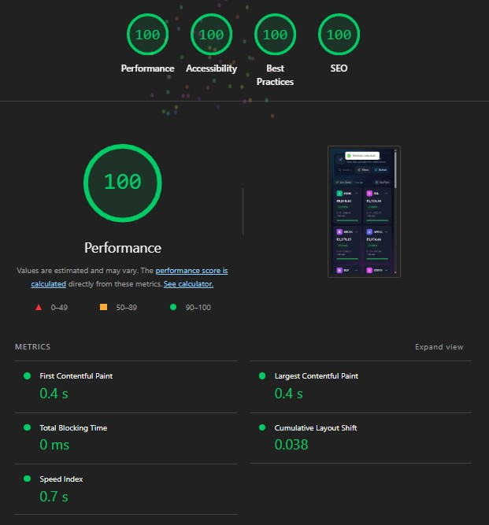

- ### Snapshot Scores:  [Snapshot Report Pdf 📑](LightHouseReport/SnapShot.pdf)
  - `Performance:` **4/4**  
  - `Accessibility:` **23/23**  
  - `Best Practices:` **5/5** 
  - `SEO:` **5/5**  

  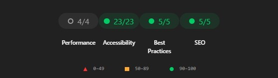


- ### Timespan Scores:  [Timespan Report Pdf 📑](LightHouseReport/TimeStamp-Report.pdf)
  - `Performance:` **11/11**  
  - `Best Practices:` **8/8**  

  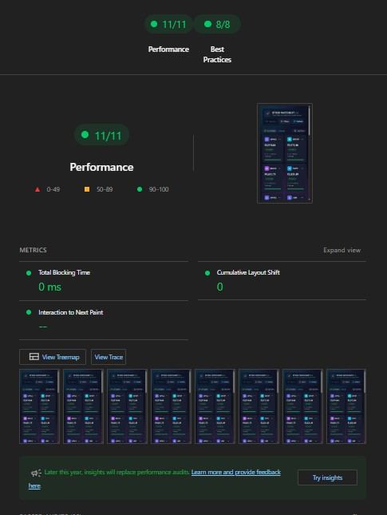

### This means the app loads fast, works well on all devices, is easy to use by everyone, and is ready for search engines. These improvements show that I care about making a good and professional project.

<br>

# What I fixed to get 100%

- ## Here are the things I improved to make the app better and get 100% in all important parts like `Performance`, `Accessibility`, Best `Practices`, and `SEO`:

  - **✔️ Optimized images by `resizing` them and using next-gen formats like `WebP`**

  - **✔️ Used responsive images with right `size` loads on `different screens`**

  - **✔️ Added `width` and `height` to images to prevent layout shift and make `loading faster`**

  - **✔️ Made sure important images like the `logo` are not `lazy loaded` for better performance**

  - **✔️ Fixed the wrong `HTML tags`**

  - **✔️ Added a `meta description` to help search engines `understand the Webpage`**

  - **✔️ Checked Lighthouse `scores` and `fixed` all `issues` they showed**

  - **✔️ Made the `navigation` `smooth` and followed best `practices` for `faster loading` and `better experien`**

  ## These changes helped the app to be fast, user-friendly, and professional.


<br>

# 🌐 Deployment

**This project is deployed on Vercel. You can view the live project here:**

### Live Link: [Stock Watch List Lite](https://stock-watch-list.vercel.app/)🌐

<br>

# Notes

- **Beginner-friendly and perfect for understanding `React`, `Tailwind CSS`, and basic `stock tracking` applications.**
- **Designed as a `Lite version`, expandable to a full-featured `stock watch app`.**

<br><br>

# 📸 Screenshots

# Desktop and Laptop View

- ### `Home Page View `
  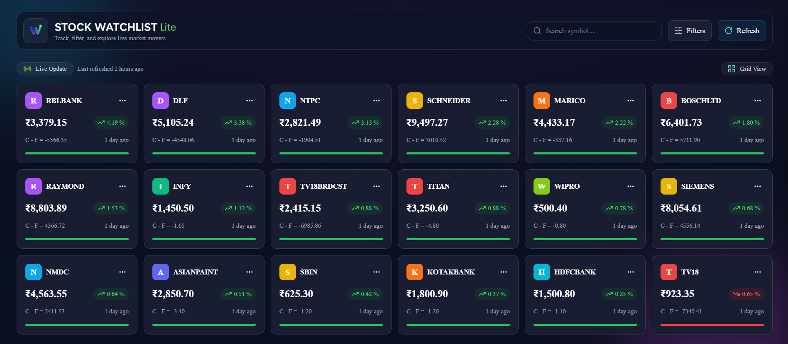
- ### `Error Fetch View`

  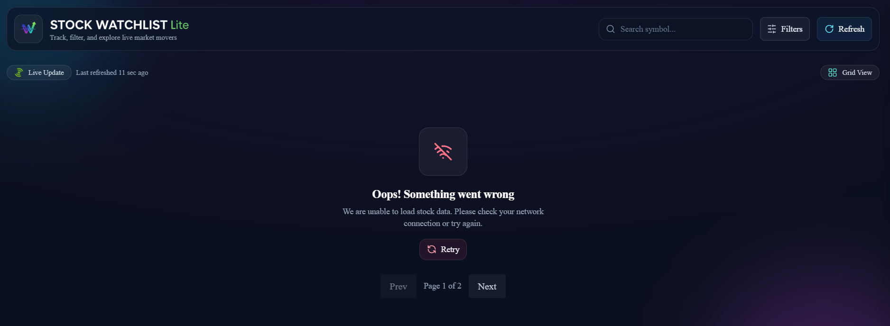

- ### `Grid View`
  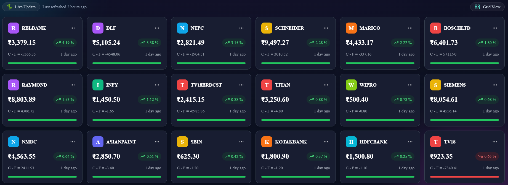
- ### `List View `

  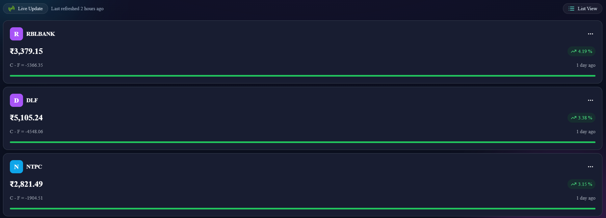

- ### `Search View `
  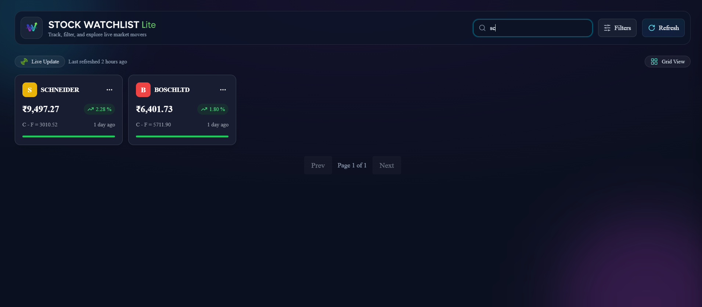
- ### `Search Not Found View`

  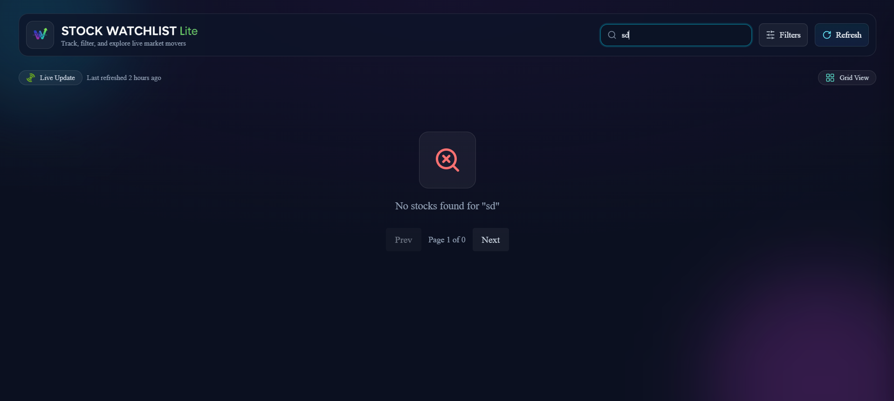

- ### `Details Drawer View`
  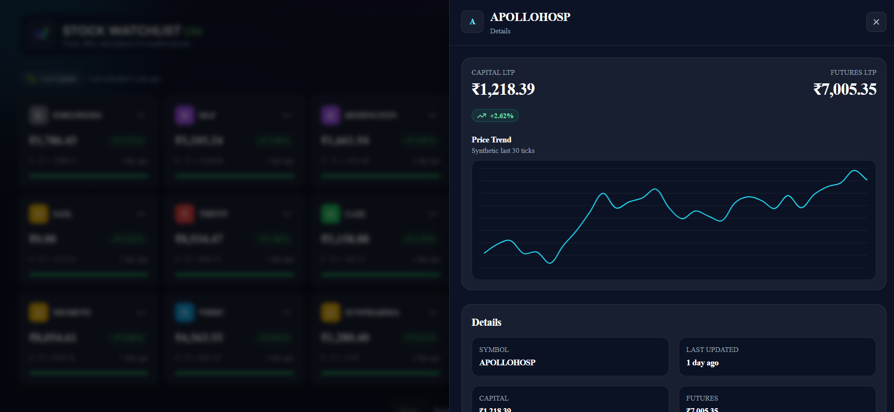
- ### `Missing Data Drawer View`

  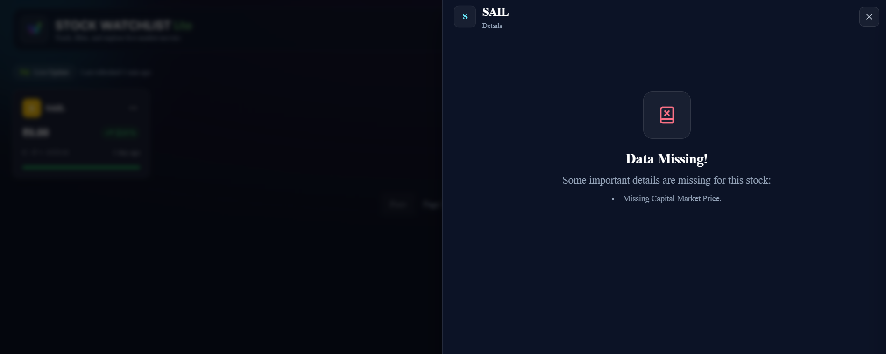

- ### `Filter Drawer View `
  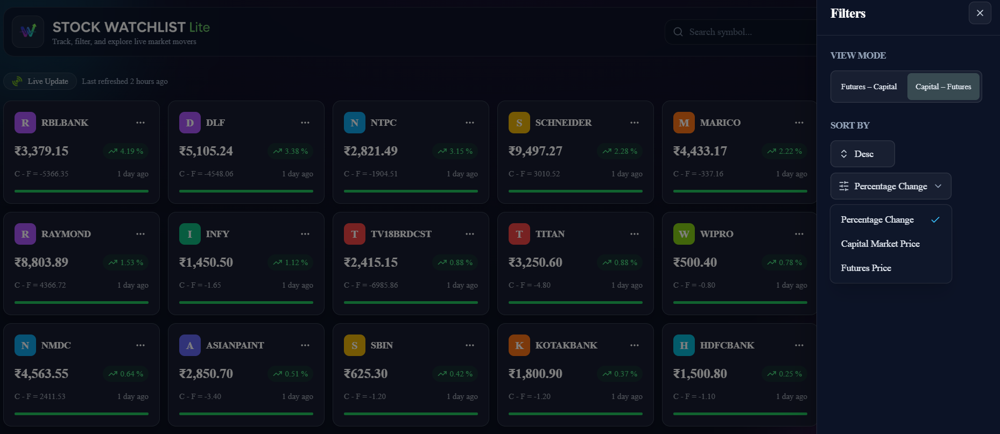
- ### `Card Toggle View `
  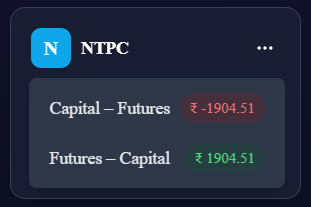
- ### `Card Skeleton View`
  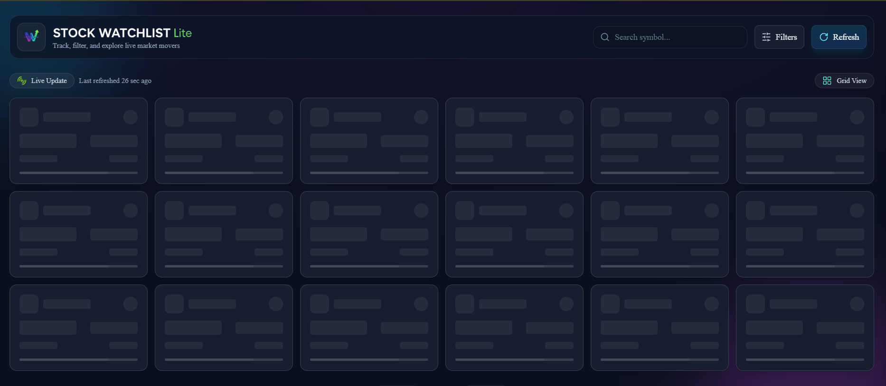

<br><br>

# 📱 Mobile Responsive View

| `Home Page View`                                     | `Error Fetch View`                                          | `Grid View`                                         |
| ---------------------------------------------------- | ----------------------------------------------------------- | --------------------------------------------------- |
| 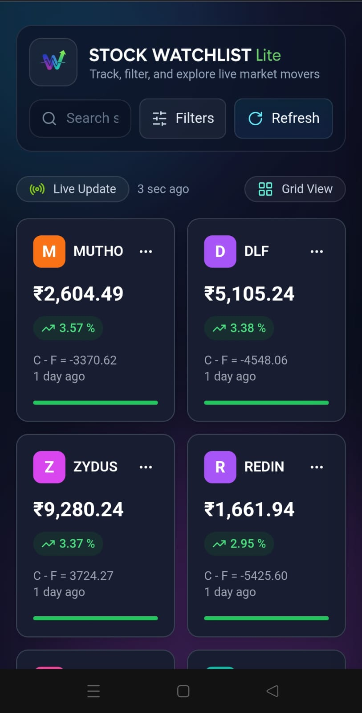 | 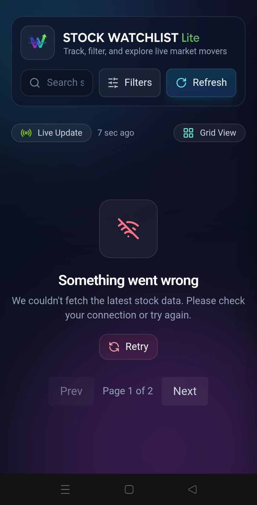 | 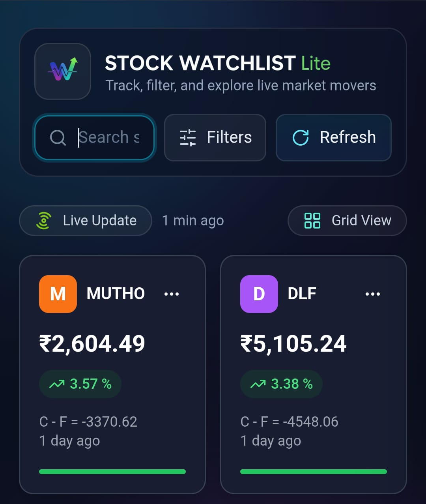 |

| `List View`                                         | `Search View`                                       | `Search Not Found View`                                               |
| --------------------------------------------------- | --------------------------------------------------- | --------------------------------------------------------------------- |
| 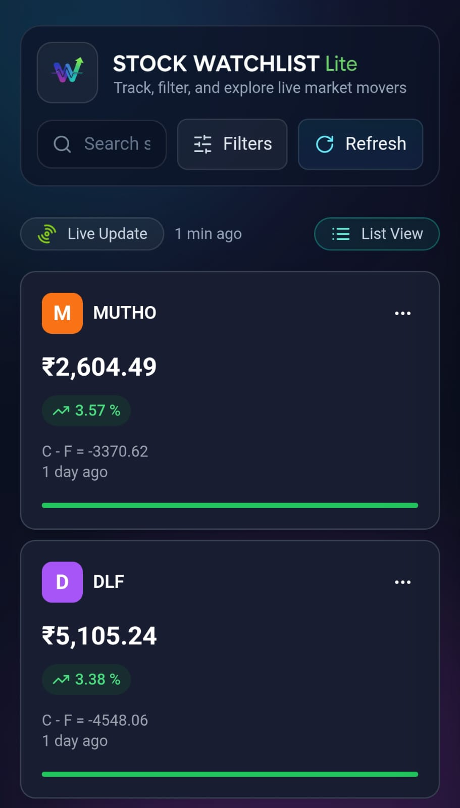 | 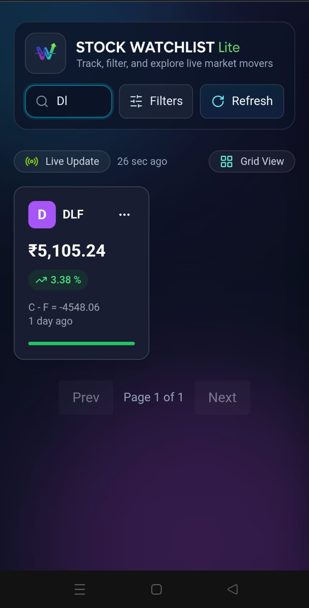 | 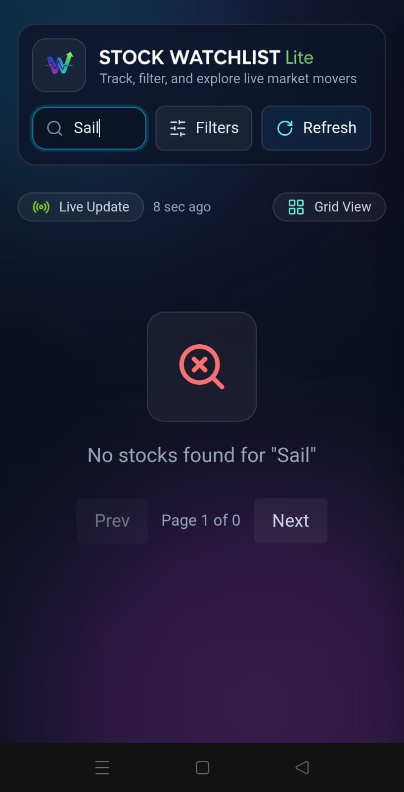 |

| `Details Drawer View`                                         | `Missing Data Drawer View`                                        | `Filter Drawer View`                                       |
| ------------------------------------------------------------- | ----------------------------------------------------------------- | ---------------------------------------------------------- |
| 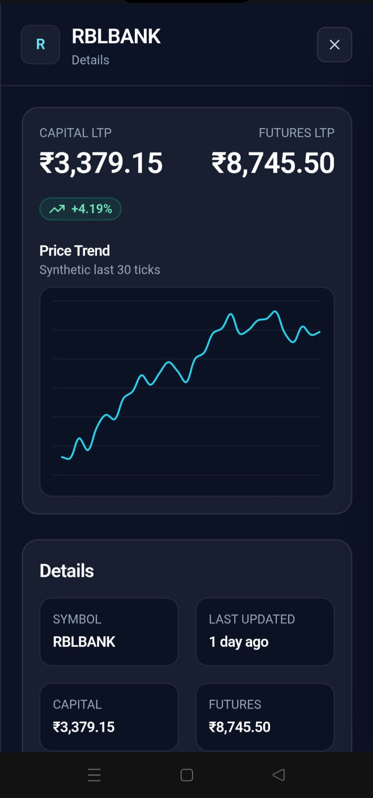 | 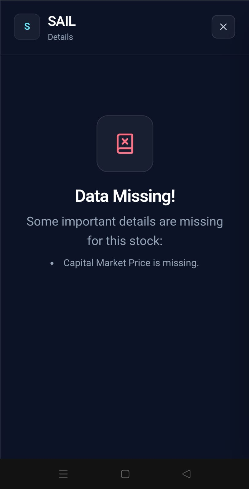 | 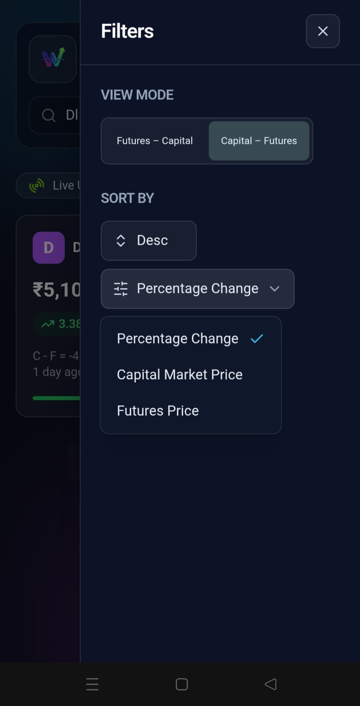 |
